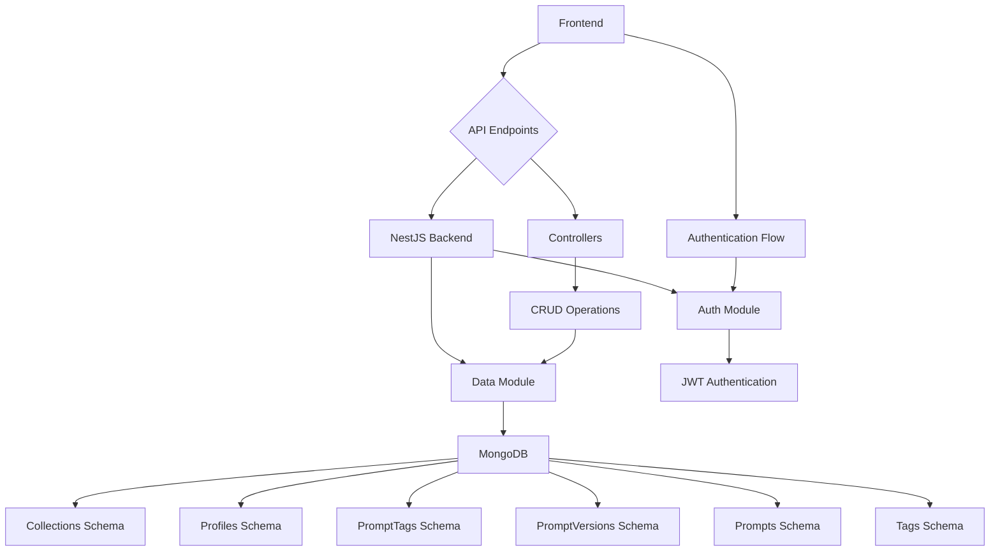
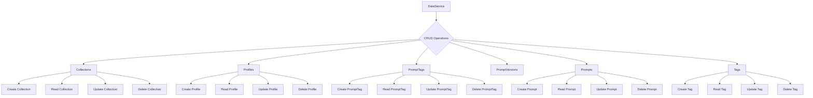

# Plan: Implement Custom Node.js Backend (NestJS)

## Overview

This plan outlines the steps to implement a custom Node.js backend using NestJS, MongoDB, and JWT for authentication.

## Steps

1.  **Backend Setup (NestJS):** Set up the NestJS project and configure the MongoDB connection.
2.  **Data Module:** Create the `data` module and define the Mongoose schemas and the `DataService`.
    - Define Mongoose schemas for each data model (`collections`, `profiles`, `prompt_tags`, `prompt_versions`, `prompts`, `tags`).
    - Create a `DataService` to handle data access logic.
      - Implement methods for CRUD operations for each data model.
3.  **Authentication Module:** Create the `auth` module and implement user registration, login, and JWT authentication.
4.  **API Endpoints:** Create controllers for each data model.
    - Implement API endpoints for CRUD operations.
    - Implement authentication middleware to protect API endpoints.
5.  **Frontend Integration:** Update the frontend to use the new API endpoints and authentication flow.

## Diagrams

### Backend Architecture

### Data Service

